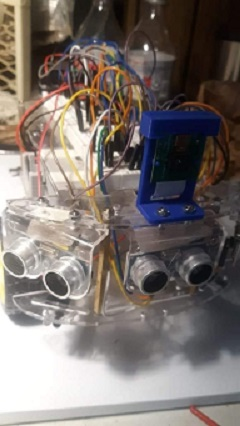
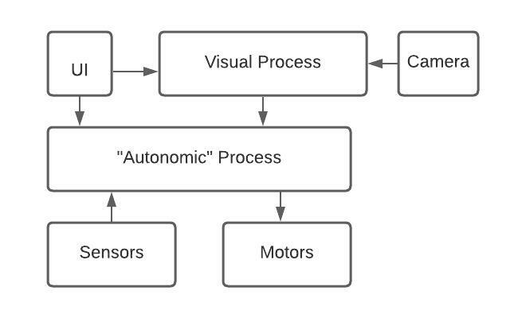

# mobilebot

Developing basic code for a two wheel differential drive mobile robot, running on a Raspberry Pi 3 SBC. 

## Features

Raspberry PI 3b SBC.
3 18650 rechargeable Li-ion batteries, providing 11.25 volts for motors and 5 volts (through convertor) to RPi
2 DC gearbox motors and wheels. 
3 Ultrasonic Rangefinder sensors, forward, to left and right at 45 degrees of center.  
2 IR proximity sensors on the front, at 30% angles  
1 forward facing camera  

## Components

**UI** - Allows start/stop of robot, or exit. 
**Visual Process** - Will accept visual data from camera for object detection and can direct robot towards/away from 
objects. Will over ride the "autonomic" process
**Autonomic Process** - Basic obstacle avoidance using data from Ultrasonic and IR sensors. 

